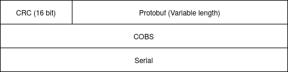
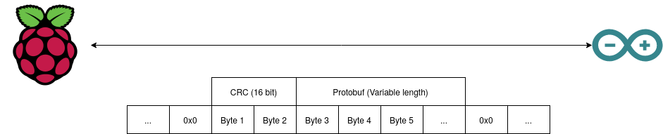

> This is a work in progress. Feedback is more than welcome.

> This document talks about yet to be implemented features. If any changes are made while implementing the below features, this document should be changed to reflect how it was implemented.

<!-- vim-markdown-toc GFM -->

* [Overview](#overview)
	* [Goals](#goals)
* [Communication](#communication)
	* [Communication Stack](#communication-stack)
	* [Protobuf Messages](#protobuf-messages)
		* [ArduinoIn](#arduinoin)
			* [Ping](#ping)
			* [Servo](#servo)
			* [Digital](#digital)
		* [ArduinoOut](#arduinoout)
			* [Acknowledgement](#acknowledgement)

<!-- vim-markdown-toc -->

# Overview

Due to limitations to the RPi GPIO, it has been decided to use an Arduino (here called Arduino proxy) for general pin input/output operations. However, having a flexible and reliable communication between the two devices is not quite trivial. This document gives an overview of how the RPi and Arduino communicate together.

## Goals
Here are the following main goals of the RPi-Arduino communication and the Arduino proxy itself:
- Reliable: Possible to detect if a message has been transmitted successfully.
- Flexible: Possible to control extra pins without flashing again the Arduino.
- Safe: Checks should be put in place to assure the correct command is executed. Moreover, the Arduino should go in a safe configuration if the RPi becomes unresponsive.
- Verbose: The RPi should know as much as possible about what is happening on the Arduino. For example, if the Arduino encounters an error, it should tell the RPi about it.

# Communication

## Communication Stack

The communication stack consists of a few components all working together to reliably send messages between the two devices.

First, we use serial for the physical link.

Second, we need an actual format to send the messages across. For simplicity and flexibility purposes, [Protocol Buffers](https://developers.google.com/protocol-buffers) is used.

Next, we need to have a way to detect errors that would be happening during the transmission. While serial does offer some basic checks with a parity bit, it could be good to have a bit more error checking. Adding a small 16 bit [CRC](https://en.wikipedia.org/wiki/Cyclic_redundancy_check) should be enough for detecting most common errors in the transmission.

Finally, because serial only send streams of bytes, we need to be able to combine those bytes into packets. For this, we use [COBS](https://en.wikipedia.org/wiki/Consistent_Overhead_Byte_Stuffing) to provide packet framing. This allows to use the 0x0 byte to separate each of the packets.

All together, here is how the communication stack looks:

Or, another way to look at it:

## Protobuf Messages

Please look at the repo (**add repo link here once it is created**) for the latest Protobuf definitions. This section will simply go over the major aspects of the messages.

### ArduinoIn

The `ArduinoIn` message encapsulates any messages sent from the RPi to the Arduino. It consists of two fields:
  - `messageId`: A randomly generated id which will allow the Arduino to send a confirmation back to the RPi to confirm the message has been received. Also allows the Arduino to ignore message it already received..
  - `data`: A `oneof` field containing the actual message to be sent across. It could be a ping, a command to set a servo to a certain value, etc.

The Arduino will sent an acknowledgement message for every message it receives. While this may not be strictly needed for all messages (say a ping), it simplifies the whole protocol.

#### Ping
The RPi sends a ping message every second to the Arduino. If the Arduino doesn't receive a ping for 10 seconds, it will fall back to a safe configuration.

> Should the Arduino switch back to the previous configuration if the RPi starts sending again pings?

#### Servo
The RPi needs to first send a `ServoInit` message to the Arduino. This will initialize the servos and also contains the safe value to fallback to. `ServoControl` messages are used to control the initialized servo.

#### Digital
The RPi needs to first send a `DigitalInit` message to the Arduino. This will initialize the digital pin and also contains the safe value to fallback to. `DigitalControl` messages are used to control the initialized digital pins.

### ArduinoOut

The `ArduinoOut` message encapsulates any messages sent from the Arduino to the RPi. It only consist of one field:
  - `data`: A `oneof` field containing the actual message to be sent across.

#### Acknowledgement
The `ACK` message is sent for every message the Arduino receives. It only data it contains is the `messageId` of the received message. 
