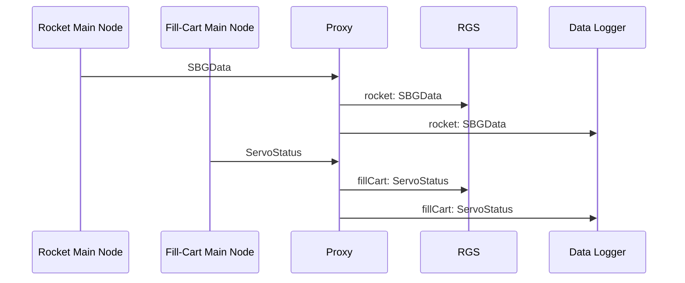

# Overview
The ground station goals are:
- Logging data it receives
- Displaying live sensor data in a user-friendly way
- Provide control to the various system
- Display an overview of the systems' status

Those goals may be accomplished by one or more separate programs working together.

# Proxy

Overview:
```diagram
PHN2ZyB4bWxucz0iaHR0cDovL3d3dy53My5vcmcvMjAwMC9zdmciIHhtbG5zOnhsaW5rPSJodHRwOi8vd3d3LnczLm9yZy8xOTk5L3hsaW5rIiB2ZXJzaW9uPSIxLjEiIHdpZHRoPSI4MjFweCIgaGVpZ2h0PSIyNDFweCIgdmlld0JveD0iLTAuNSAtMC41IDgyMSAyNDEiIGNvbnRlbnQ9IiZsdDtteGZpbGUgaG9zdD0mcXVvdDtlbWJlZC5kaWFncmFtcy5uZXQmcXVvdDsgbW9kaWZpZWQ9JnF1b3Q7MjAyMi0xMi0wMVQwMToxMToyMi43MDdaJnF1b3Q7IGFnZW50PSZxdW90OzUuMCAoWDExKSZxdW90OyBldGFnPSZxdW90O1dJOUZtTHFOTTFiUDNIbFlfLWpZJnF1b3Q7IHZlcnNpb249JnF1b3Q7MjAuNi4wJnF1b3Q7IHR5cGU9JnF1b3Q7ZW1iZWQmcXVvdDsmZ3Q7Jmx0O2RpYWdyYW0gaWQ9JnF1b3Q7ZmJmRS1SbngxZ1o4Z0k5NWdES0cmcXVvdDsgbmFtZT0mcXVvdDtQYWdlLTEmcXVvdDsmZ3Q7NVZqYmN0b3dFUDBhUDVMeEJSdnp5Q1doN1pBMlUyWjZlWlF0MlZZUkZpUExYUEwxWFdNSjQ5aGttQ1NGa003d1lCM3RycVN6dTlvVmhqTmFiQ1lDTFpON2pna3piQk52REdkczJMYlZ0VzJqK0psNFd5STkxeXlCV0ZDc2hDcGdSaCtKQXJWWVRqSEphb0tTY3licHNnNkdQRTFKS0dzWUVvS3Y2MklSWi9WVmx5Z21EV0FXSXRaRWYxSXNreEwxOVNrSy9CT2hjYUpYdGt3MXMwQmFXQUZaZ2pCZkgwRE9yZUdNQk9leS9GcHNSb1FWNUdsZVNyMjdJN1A3alFtU3lwTVU5RDdrVmgrT1lEaXJHbkloRXg3ekZMSGJDaDBLbnFlWUZCWk1HRlV5VTg2WEFGb0EvaUZTYnBYalVDNDVRSWxjTURVTG14UGJYMHAvTi9oZERHNWNQUnh2RGlmSFd6WEtKQkp5VURnUWdKQ2hMS09oaHU4bzArYWJKQ2hlTXA2TFVCM1RVM0dEUkV5VVZLK0VDZ0lPMUJSeEU4SVhCRFlEQW9Jd0pPbXFIZ3hJeFZTOGw2dG9ody9GL0JFdldKZnd3a3RwOGk5R2szMU53ZnBTZXZ1WG90ZDJTaHNyeEhKbDFiQTlCdHNhWXJxQ3o3ajRIS0ZsQ2tJUGdnTlJham9RZWxZanNOYUJUb3NadmlLZ1pNNTRPQ2Z5NXZPM1k0b3QvcDZpQU9wSnpVZUkwVGd0N2dUZ0d1dzZRN0F1S1Z6WUF6V3hvQmlYNFVBeStvaUNuYjNDUzB0T1U3a2p6UjBhN2hnUVZwZ2ZvbkFlNzBKbnhCa0hpMk5NSXBRejJlNVlGWmpGcW1SVGM0Z3FRV3JGMmkxZjg2YlM2cGczbnRkM1MxMVZIVHZLMU1rT1Y5WWZpcU5WcHExdXExVnRnRWRSQmlINE5GNzJXendwaEx4R0JFR2NiTFlOTjlhVGNwMVFTV1pMdEV1S05iUU1kZWRHY0xOckx4aTJFMFdSSFpiWHZ1QnpjakNEdmNCenZlZFNyK0dnbzQ1d2RjbmU2dVJRNDNWVjhLMnV3cEtEWXUrYnI4L0VYb1BHNzVQWm01S0lYZUxqYmh1SnZoMDQzaHVSMkg5Q291V2VrVVMvUWVJWHRFS0FUSGJFZFdZU3NvbW5INERXczhabXYwSHJHTW1DMWltUFk1ckdINEJQeHpvam4vYjFkdUFwVDhtVDl2dmt4c2ZxTlRzZjcxS2RqOVc4Y0tjY3VnZUE0RnprZUp0RE5iQnJoNEk4T21oajZORW01bFhWenc5SmUvVUxmTGZyUHN2LzZSbXhqOHBMWE56MlJWNUQ3K0ZOYXZudktTbWFCYlNsajU4UlFZdEVPYkh0YnlSTy9UbGhxbWZCL2VESGxLYno5bXc2OWMxeDlWbDMxcnB1WDlYaitrMnpyditlc3E3Wlg3VTl3Z2RmTzhNOGV6N3QvcGZpOUMvYk5SaFdmOGFXRCtMcUwyM245aTg9Jmx0Oy9kaWFncmFtJmd0OyZsdDsvbXhmaWxlJmd0OyI+PGRlZnMvPjxnPjxwYXRoIGQ9Ik0gNDI2LjM3IDEyMCBMIDU1MCAxMjAgTCA1NTAgNDAgTCA2NzMuNjMgNDAiIGZpbGw9Im5vbmUiIHN0cm9rZT0icmdiKDAsIDAsIDApIiBzdHJva2UtbWl0ZXJsaW1pdD0iMTAiIHBvaW50ZXItZXZlbnRzPSJzdHJva2UiLz48cGF0aCBkPSJNIDQyMS4xMiAxMjAgTCA0MjguMTIgMTE2LjUgTCA0MjYuMzcgMTIwIEwgNDI4LjEyIDEyMy41IFoiIGZpbGw9InJnYigwLCAwLCAwKSIgc3Ryb2tlPSJyZ2IoMCwgMCwgMCkiIHN0cm9rZS1taXRlcmxpbWl0PSIxMCIgcG9pbnRlci1ldmVudHM9ImFsbCIvPjxwYXRoIGQ9Ik0gNjc4Ljg4IDQwIEwgNjcxLjg4IDQzLjUgTCA2NzMuNjMgNDAgTCA2NzEuODggMzYuNSBaIiBmaWxsPSJyZ2IoMCwgMCwgMCkiIHN0cm9rZT0icmdiKDAsIDAsIDApIiBzdHJva2UtbWl0ZXJsaW1pdD0iMTAiIHBvaW50ZXItZXZlbnRzPSJhbGwiLz48cGF0aCBkPSJNIDQyMCAxMjAgTCA2NzMuNjMgMTIwIiBmaWxsPSJub25lIiBzdHJva2U9InJnYigwLCAwLCAwKSIgc3Ryb2tlLW1pdGVybGltaXQ9IjEwIiBwb2ludGVyLWV2ZW50cz0ic3Ryb2tlIi8+PHBhdGggZD0iTSA2NzguODggMTIwIEwgNjcxLjg4IDEyMy41IEwgNjczLjYzIDEyMCBMIDY3MS44OCAxMTYuNSBaIiBmaWxsPSJyZ2IoMCwgMCwgMCkiIHN0cm9rZT0icmdiKDAsIDAsIDApIiBzdHJva2UtbWl0ZXJsaW1pdD0iMTAiIHBvaW50ZXItZXZlbnRzPSJhbGwiLz48cGF0aCBkPSJNIDQyMCAxMjAgTCA1NTAgMTIwIEwgNTUwIDIwMCBMIDY3My42MyAyMDAiIGZpbGw9Im5vbmUiIHN0cm9rZT0icmdiKDAsIDAsIDApIiBzdHJva2UtbWl0ZXJsaW1pdD0iMTAiIHBvaW50ZXItZXZlbnRzPSJzdHJva2UiLz48cGF0aCBkPSJNIDY3OC44OCAyMDAgTCA2NzEuODggMjAzLjUgTCA2NzMuNjMgMjAwIEwgNjcxLjg4IDE5Ni41IFoiIGZpbGw9InJnYigwLCAwLCAwKSIgc3Ryb2tlPSJyZ2IoMCwgMCwgMCkiIHN0cm9rZS1taXRlcmxpbWl0PSIxMCIgcG9pbnRlci1ldmVudHM9ImFsbCIvPjxnIHRyYW5zZm9ybT0idHJhbnNsYXRlKC0wLjUgLTAuNSkiPjxzd2l0Y2g+PGZvcmVpZ25PYmplY3Qgc3R5bGU9Im92ZXJmbG93OiB2aXNpYmxlOyB0ZXh0LWFsaWduOiBsZWZ0OyIgcG9pbnRlci1ldmVudHM9Im5vbmUiIHdpZHRoPSIxMDAlIiBoZWlnaHQ9IjEwMCUiIHJlcXVpcmVkRmVhdHVyZXM9Imh0dHA6Ly93d3cudzMub3JnL1RSL1NWRzExL2ZlYXR1cmUjRXh0ZW5zaWJpbGl0eSI+PGRpdiB4bWxucz0iaHR0cDovL3d3dy53My5vcmcvMTk5OS94aHRtbCIgc3R5bGU9ImRpc3BsYXk6IGZsZXg7IGFsaWduLWl0ZW1zOiB1bnNhZmUgY2VudGVyOyBqdXN0aWZ5LWNvbnRlbnQ6IHVuc2FmZSBjZW50ZXI7IHdpZHRoOiAxcHg7IGhlaWdodDogMXB4OyBwYWRkaW5nLXRvcDogMTIxcHg7IG1hcmdpbi1sZWZ0OiA0OTFweDsiPjxkaXYgc3R5bGU9ImJveC1zaXppbmc6IGJvcmRlci1ib3g7IGZvbnQtc2l6ZTogMHB4OyB0ZXh0LWFsaWduOiBjZW50ZXI7IiBkYXRhLWRyYXdpby1jb2xvcnM9ImNvbG9yOiByZ2IoMCwgMCwgMCk7IGJhY2tncm91bmQtY29sb3I6IHJnYigyNTUsIDI1NSwgMjU1KTsgIj48ZGl2IHN0eWxlPSJkaXNwbGF5OiBpbmxpbmUtYmxvY2s7IGZvbnQtc2l6ZTogMTFweDsgZm9udC1mYW1pbHk6IEhlbHZldGljYTsgY29sb3I6IHJnYigwLCAwLCAwKTsgbGluZS1oZWlnaHQ6IDEuMjsgcG9pbnRlci1ldmVudHM6IGFsbDsgYmFja2dyb3VuZC1jb2xvcjogcmdiKDI1NSwgMjU1LCAyNTUpOyB3aGl0ZS1zcGFjZTogbm93cmFwOyI+PGRpdj5DYXBuIFByb3RvPGJyIC8+PC9kaXY+PGRpdj5vdmVyIFNvY2tldC5JTzwvZGl2PjwvZGl2PjwvZGl2PjwvZGl2PjwvZm9yZWlnbk9iamVjdD48dGV4dCB4PSI0OTEiIHk9IjEyNCIgZmlsbD0icmdiKDAsIDAsIDApIiBmb250LWZhbWlseT0iSGVsdmV0aWNhIiBmb250LXNpemU9IjExcHgiIHRleHQtYW5jaG9yPSJtaWRkbGUiPkNhcG4gUHJvdG8uLi48L3RleHQ+PC9zd2l0Y2g+PC9nPjxyZWN0IHg9IjI4MCIgeT0iODAiIHdpZHRoPSIxNDAiIGhlaWdodD0iODAiIGZpbGw9IiNmZmYyY2MiIHN0cm9rZT0iI2Q2YjY1NiIgcG9pbnRlci1ldmVudHM9ImFsbCIvPjxnIHRyYW5zZm9ybT0idHJhbnNsYXRlKC0wLjUgLTAuNSkiPjxzd2l0Y2g+PGZvcmVpZ25PYmplY3Qgc3R5bGU9Im92ZXJmbG93OiB2aXNpYmxlOyB0ZXh0LWFsaWduOiBsZWZ0OyIgcG9pbnRlci1ldmVudHM9Im5vbmUiIHdpZHRoPSIxMDAlIiBoZWlnaHQ9IjEwMCUiIHJlcXVpcmVkRmVhdHVyZXM9Imh0dHA6Ly93d3cudzMub3JnL1RSL1NWRzExL2ZlYXR1cmUjRXh0ZW5zaWJpbGl0eSI+PGRpdiB4bWxucz0iaHR0cDovL3d3dy53My5vcmcvMTk5OS94aHRtbCIgc3R5bGU9ImRpc3BsYXk6IGZsZXg7IGFsaWduLWl0ZW1zOiB1bnNhZmUgY2VudGVyOyBqdXN0aWZ5LWNvbnRlbnQ6IHVuc2FmZSBjZW50ZXI7IHdpZHRoOiAxMzhweDsgaGVpZ2h0OiAxcHg7IHBhZGRpbmctdG9wOiAxMjBweDsgbWFyZ2luLWxlZnQ6IDI4MXB4OyI+PGRpdiBzdHlsZT0iYm94LXNpemluZzogYm9yZGVyLWJveDsgZm9udC1zaXplOiAwcHg7IHRleHQtYWxpZ246IGNlbnRlcjsiIGRhdGEtZHJhd2lvLWNvbG9ycz0iY29sb3I6IHJnYigwLCAwLCAwKTsgIj48ZGl2IHN0eWxlPSJkaXNwbGF5OiBpbmxpbmUtYmxvY2s7IGZvbnQtc2l6ZTogMTJweDsgZm9udC1mYW1pbHk6IEhlbHZldGljYTsgY29sb3I6IHJnYigwLCAwLCAwKTsgbGluZS1oZWlnaHQ6IDEuMjsgcG9pbnRlci1ldmVudHM6IGFsbDsgd2hpdGUtc3BhY2U6IG5vcm1hbDsgb3ZlcmZsb3ctd3JhcDogbm9ybWFsOyI+UHJveHk8L2Rpdj48L2Rpdj48L2Rpdj48L2ZvcmVpZ25PYmplY3Q+PHRleHQgeD0iMzUwIiB5PSIxMjQiIGZpbGw9InJnYigwLCAwLCAwKSIgZm9udC1mYW1pbHk9IkhlbHZldGljYSIgZm9udC1zaXplPSIxMnB4IiB0ZXh0LWFuY2hvcj0ibWlkZGxlIj5Qcm94eTwvdGV4dD48L3N3aXRjaD48L2c+PHJlY3QgeD0iNjgwIiB5PSIwIiB3aWR0aD0iMTQwIiBoZWlnaHQ9IjgwIiBmaWxsPSIjZDVlOGQ0IiBzdHJva2U9IiM4MmIzNjYiIHBvaW50ZXItZXZlbnRzPSJhbGwiLz48ZyB0cmFuc2Zvcm09InRyYW5zbGF0ZSgtMC41IC0wLjUpIj48c3dpdGNoPjxmb3JlaWduT2JqZWN0IHN0eWxlPSJvdmVyZmxvdzogdmlzaWJsZTsgdGV4dC1hbGlnbjogbGVmdDsiIHBvaW50ZXItZXZlbnRzPSJub25lIiB3aWR0aD0iMTAwJSIgaGVpZ2h0PSIxMDAlIiByZXF1aXJlZEZlYXR1cmVzPSJodHRwOi8vd3d3LnczLm9yZy9UUi9TVkcxMS9mZWF0dXJlI0V4dGVuc2liaWxpdHkiPjxkaXYgeG1sbnM9Imh0dHA6Ly93d3cudzMub3JnLzE5OTkveGh0bWwiIHN0eWxlPSJkaXNwbGF5OiBmbGV4OyBhbGlnbi1pdGVtczogdW5zYWZlIGNlbnRlcjsganVzdGlmeS1jb250ZW50OiB1bnNhZmUgY2VudGVyOyB3aWR0aDogMTM4cHg7IGhlaWdodDogMXB4OyBwYWRkaW5nLXRvcDogNDBweDsgbWFyZ2luLWxlZnQ6IDY4MXB4OyI+PGRpdiBzdHlsZT0iYm94LXNpemluZzogYm9yZGVyLWJveDsgZm9udC1zaXplOiAwcHg7IHRleHQtYWxpZ246IGNlbnRlcjsiIGRhdGEtZHJhd2lvLWNvbG9ycz0iY29sb3I6IHJnYigwLCAwLCAwKTsgIj48ZGl2IHN0eWxlPSJkaXNwbGF5OiBpbmxpbmUtYmxvY2s7IGZvbnQtc2l6ZTogMTJweDsgZm9udC1mYW1pbHk6IEhlbHZldGljYTsgY29sb3I6IHJnYigwLCAwLCAwKTsgbGluZS1oZWlnaHQ6IDEuMjsgcG9pbnRlci1ldmVudHM6IGFsbDsgd2hpdGUtc3BhY2U6IG5vcm1hbDsgb3ZlcmZsb3ctd3JhcDogbm9ybWFsOyI+UkdTPC9kaXY+PC9kaXY+PC9kaXY+PC9mb3JlaWduT2JqZWN0Pjx0ZXh0IHg9Ijc1MCIgeT0iNDQiIGZpbGw9InJnYigwLCAwLCAwKSIgZm9udC1mYW1pbHk9IkhlbHZldGljYSIgZm9udC1zaXplPSIxMnB4IiB0ZXh0LWFuY2hvcj0ibWlkZGxlIj5SR1M8L3RleHQ+PC9zd2l0Y2g+PC9nPjxyZWN0IHg9IjY4MCIgeT0iODAiIHdpZHRoPSIxNDAiIGhlaWdodD0iODAiIGZpbGw9IiNkNWU4ZDQiIHN0cm9rZT0iIzgyYjM2NiIgcG9pbnRlci1ldmVudHM9ImFsbCIvPjxnIHRyYW5zZm9ybT0idHJhbnNsYXRlKC0wLjUgLTAuNSkiPjxzd2l0Y2g+PGZvcmVpZ25PYmplY3Qgc3R5bGU9Im92ZXJmbG93OiB2aXNpYmxlOyB0ZXh0LWFsaWduOiBsZWZ0OyIgcG9pbnRlci1ldmVudHM9Im5vbmUiIHdpZHRoPSIxMDAlIiBoZWlnaHQ9IjEwMCUiIHJlcXVpcmVkRmVhdHVyZXM9Imh0dHA6Ly93d3cudzMub3JnL1RSL1NWRzExL2ZlYXR1cmUjRXh0ZW5zaWJpbGl0eSI+PGRpdiB4bWxucz0iaHR0cDovL3d3dy53My5vcmcvMTk5OS94aHRtbCIgc3R5bGU9ImRpc3BsYXk6IGZsZXg7IGFsaWduLWl0ZW1zOiB1bnNhZmUgY2VudGVyOyBqdXN0aWZ5LWNvbnRlbnQ6IHVuc2FmZSBjZW50ZXI7IHdpZHRoOiAxMzhweDsgaGVpZ2h0OiAxcHg7IHBhZGRpbmctdG9wOiAxMjBweDsgbWFyZ2luLWxlZnQ6IDY4MXB4OyI+PGRpdiBzdHlsZT0iYm94LXNpemluZzogYm9yZGVyLWJveDsgZm9udC1zaXplOiAwcHg7IHRleHQtYWxpZ246IGNlbnRlcjsiIGRhdGEtZHJhd2lvLWNvbG9ycz0iY29sb3I6IHJnYigwLCAwLCAwKTsgIj48ZGl2IHN0eWxlPSJkaXNwbGF5OiBpbmxpbmUtYmxvY2s7IGZvbnQtc2l6ZTogMTJweDsgZm9udC1mYW1pbHk6IEhlbHZldGljYTsgY29sb3I6IHJnYigwLCAwLCAwKTsgbGluZS1oZWlnaHQ6IDEuMjsgcG9pbnRlci1ldmVudHM6IGFsbDsgd2hpdGUtc3BhY2U6IG5vcm1hbDsgb3ZlcmZsb3ctd3JhcDogbm9ybWFsOyI+SmF2YSBHcm91bmQtU3RhdGlvbjwvZGl2PjwvZGl2PjwvZGl2PjwvZm9yZWlnbk9iamVjdD48dGV4dCB4PSI3NTAiIHk9IjEyNCIgZmlsbD0icmdiKDAsIDAsIDApIiBmb250LWZhbWlseT0iSGVsdmV0aWNhIiBmb250LXNpemU9IjEycHgiIHRleHQtYW5jaG9yPSJtaWRkbGUiPkphdmEgR3JvdW5kLVN0YXRpb248L3RleHQ+PC9zd2l0Y2g+PC9nPjxyZWN0IHg9IjY4MCIgeT0iMTYwIiB3aWR0aD0iMTQwIiBoZWlnaHQ9IjgwIiBmaWxsPSIjZDVlOGQ0IiBzdHJva2U9IiM4MmIzNjYiIHBvaW50ZXItZXZlbnRzPSJhbGwiLz48ZyB0cmFuc2Zvcm09InRyYW5zbGF0ZSgtMC41IC0wLjUpIj48c3dpdGNoPjxmb3JlaWduT2JqZWN0IHN0eWxlPSJvdmVyZmxvdzogdmlzaWJsZTsgdGV4dC1hbGlnbjogbGVmdDsiIHBvaW50ZXItZXZlbnRzPSJub25lIiB3aWR0aD0iMTAwJSIgaGVpZ2h0PSIxMDAlIiByZXF1aXJlZEZlYXR1cmVzPSJodHRwOi8vd3d3LnczLm9yZy9UUi9TVkcxMS9mZWF0dXJlI0V4dGVuc2liaWxpdHkiPjxkaXYgeG1sbnM9Imh0dHA6Ly93d3cudzMub3JnLzE5OTkveGh0bWwiIHN0eWxlPSJkaXNwbGF5OiBmbGV4OyBhbGlnbi1pdGVtczogdW5zYWZlIGNlbnRlcjsganVzdGlmeS1jb250ZW50OiB1bnNhZmUgY2VudGVyOyB3aWR0aDogMTM4cHg7IGhlaWdodDogMXB4OyBwYWRkaW5nLXRvcDogMjAwcHg7IG1hcmdpbi1sZWZ0OiA2ODFweDsiPjxkaXYgc3R5bGU9ImJveC1zaXppbmc6IGJvcmRlci1ib3g7IGZvbnQtc2l6ZTogMHB4OyB0ZXh0LWFsaWduOiBjZW50ZXI7IiBkYXRhLWRyYXdpby1jb2xvcnM9ImNvbG9yOiByZ2IoMCwgMCwgMCk7ICI+PGRpdiBzdHlsZT0iZGlzcGxheTogaW5saW5lLWJsb2NrOyBmb250LXNpemU6IDEycHg7IGZvbnQtZmFtaWx5OiBIZWx2ZXRpY2E7IGNvbG9yOiByZ2IoMCwgMCwgMCk7IGxpbmUtaGVpZ2h0OiAxLjI7IHBvaW50ZXItZXZlbnRzOiBhbGw7IHdoaXRlLXNwYWNlOiBub3JtYWw7IG92ZXJmbG93LXdyYXA6IG5vcm1hbDsiPkRhdGEgTG9nZ2luZzwvZGl2PjwvZGl2PjwvZGl2PjwvZm9yZWlnbk9iamVjdD48dGV4dCB4PSI3NTAiIHk9IjIwNCIgZmlsbD0icmdiKDAsIDAsIDApIiBmb250LWZhbWlseT0iSGVsdmV0aWNhIiBmb250LXNpemU9IjEycHgiIHRleHQtYW5jaG9yPSJtaWRkbGUiPkRhdGEgTG9nZ2luZzwvdGV4dD48L3N3aXRjaD48L2c+PHBhdGggZD0iTSAxNDAgNDAgTCAyMTAgNDAgTCAyMTAgMTIwIEwgMjczLjYzIDEyMCIgZmlsbD0ibm9uZSIgc3Ryb2tlPSJyZ2IoMCwgMCwgMCkiIHN0cm9rZS1taXRlcmxpbWl0PSIxMCIgcG9pbnRlci1ldmVudHM9InN0cm9rZSIvPjxwYXRoIGQ9Ik0gMjc4Ljg4IDEyMCBMIDI3MS44OCAxMjMuNSBMIDI3My42MyAxMjAgTCAyNzEuODggMTE2LjUgWiIgZmlsbD0icmdiKDAsIDAsIDApIiBzdHJva2U9InJnYigwLCAwLCAwKSIgc3Ryb2tlLW1pdGVybGltaXQ9IjEwIiBwb2ludGVyLWV2ZW50cz0iYWxsIi8+PHJlY3QgeD0iMCIgeT0iMCIgd2lkdGg9IjE0MCIgaGVpZ2h0PSI4MCIgZmlsbD0iI2Y4Y2VjYyIgc3Ryb2tlPSIjYjg1NDUwIiBwb2ludGVyLWV2ZW50cz0iYWxsIi8+PGcgdHJhbnNmb3JtPSJ0cmFuc2xhdGUoLTAuNSAtMC41KSI+PHN3aXRjaD48Zm9yZWlnbk9iamVjdCBzdHlsZT0ib3ZlcmZsb3c6IHZpc2libGU7IHRleHQtYWxpZ246IGxlZnQ7IiBwb2ludGVyLWV2ZW50cz0ibm9uZSIgd2lkdGg9IjEwMCUiIGhlaWdodD0iMTAwJSIgcmVxdWlyZWRGZWF0dXJlcz0iaHR0cDovL3d3dy53My5vcmcvVFIvU1ZHMTEvZmVhdHVyZSNFeHRlbnNpYmlsaXR5Ij48ZGl2IHhtbG5zPSJodHRwOi8vd3d3LnczLm9yZy8xOTk5L3hodG1sIiBzdHlsZT0iZGlzcGxheTogZmxleDsgYWxpZ24taXRlbXM6IHVuc2FmZSBjZW50ZXI7IGp1c3RpZnktY29udGVudDogdW5zYWZlIGNlbnRlcjsgd2lkdGg6IDEzOHB4OyBoZWlnaHQ6IDFweDsgcGFkZGluZy10b3A6IDQwcHg7IG1hcmdpbi1sZWZ0OiAxcHg7Ij48ZGl2IHN0eWxlPSJib3gtc2l6aW5nOiBib3JkZXItYm94OyBmb250LXNpemU6IDBweDsgdGV4dC1hbGlnbjogY2VudGVyOyIgZGF0YS1kcmF3aW8tY29sb3JzPSJjb2xvcjogcmdiKDAsIDAsIDApOyAiPjxkaXYgc3R5bGU9ImRpc3BsYXk6IGlubGluZS1ibG9jazsgZm9udC1zaXplOiAxMnB4OyBmb250LWZhbWlseTogSGVsdmV0aWNhOyBjb2xvcjogcmdiKDAsIDAsIDApOyBsaW5lLWhlaWdodDogMS4yOyBwb2ludGVyLWV2ZW50czogYWxsOyB3aGl0ZS1zcGFjZTogbm9ybWFsOyBvdmVyZmxvdy13cmFwOiBub3JtYWw7Ij5Mb2NhbCBGaWxlPGJyIC8+PGk+UHJvdG9idWY8L2k+PC9kaXY+PC9kaXY+PC9kaXY+PC9mb3JlaWduT2JqZWN0Pjx0ZXh0IHg9IjcwIiB5PSI0NCIgZmlsbD0icmdiKDAsIDAsIDApIiBmb250LWZhbWlseT0iSGVsdmV0aWNhIiBmb250LXNpemU9IjEycHgiIHRleHQtYW5jaG9yPSJtaWRkbGUiPkxvY2FsIEZpbGUuLi48L3RleHQ+PC9zd2l0Y2g+PC9nPjxwYXRoIGQ9Ik0gMTQ2LjM3IDEyMCBMIDI3My42MyAxMjAiIGZpbGw9Im5vbmUiIHN0cm9rZT0icmdiKDAsIDAsIDApIiBzdHJva2UtbWl0ZXJsaW1pdD0iMTAiIHBvaW50ZXItZXZlbnRzPSJzdHJva2UiLz48cGF0aCBkPSJNIDE0MS4xMiAxMjAgTCAxNDguMTIgMTE2LjUgTCAxNDYuMzcgMTIwIEwgMTQ4LjEyIDEyMy41IFoiIGZpbGw9InJnYigwLCAwLCAwKSIgc3Ryb2tlPSJyZ2IoMCwgMCwgMCkiIHN0cm9rZS1taXRlcmxpbWl0PSIxMCIgcG9pbnRlci1ldmVudHM9ImFsbCIvPjxwYXRoIGQ9Ik0gMjc4Ljg4IDEyMCBMIDI3MS44OCAxMjMuNSBMIDI3My42MyAxMjAgTCAyNzEuODggMTE2LjUgWiIgZmlsbD0icmdiKDAsIDAsIDApIiBzdHJva2U9InJnYigwLCAwLCAwKSIgc3Ryb2tlLW1pdGVybGltaXQ9IjEwIiBwb2ludGVyLWV2ZW50cz0iYWxsIi8+PHJlY3QgeD0iMCIgeT0iODAiIHdpZHRoPSIxNDAiIGhlaWdodD0iODAiIGZpbGw9IiNmOGNlY2MiIHN0cm9rZT0iI2I4NTQ1MCIgcG9pbnRlci1ldmVudHM9ImFsbCIvPjxnIHRyYW5zZm9ybT0idHJhbnNsYXRlKC0wLjUgLTAuNSkiPjxzd2l0Y2g+PGZvcmVpZ25PYmplY3Qgc3R5bGU9Im92ZXJmbG93OiB2aXNpYmxlOyB0ZXh0LWFsaWduOiBsZWZ0OyIgcG9pbnRlci1ldmVudHM9Im5vbmUiIHdpZHRoPSIxMDAlIiBoZWlnaHQ9IjEwMCUiIHJlcXVpcmVkRmVhdHVyZXM9Imh0dHA6Ly93d3cudzMub3JnL1RSL1NWRzExL2ZlYXR1cmUjRXh0ZW5zaWJpbGl0eSI+PGRpdiB4bWxucz0iaHR0cDovL3d3dy53My5vcmcvMTk5OS94aHRtbCIgc3R5bGU9ImRpc3BsYXk6IGZsZXg7IGFsaWduLWl0ZW1zOiB1bnNhZmUgY2VudGVyOyBqdXN0aWZ5LWNvbnRlbnQ6IHVuc2FmZSBjZW50ZXI7IHdpZHRoOiAxMzhweDsgaGVpZ2h0OiAxcHg7IHBhZGRpbmctdG9wOiAxMjBweDsgbWFyZ2luLWxlZnQ6IDFweDsiPjxkaXYgc3R5bGU9ImJveC1zaXppbmc6IGJvcmRlci1ib3g7IGZvbnQtc2l6ZTogMHB4OyB0ZXh0LWFsaWduOiBjZW50ZXI7IiBkYXRhLWRyYXdpby1jb2xvcnM9ImNvbG9yOiByZ2IoMCwgMCwgMCk7ICI+PGRpdiBzdHlsZT0iZGlzcGxheTogaW5saW5lLWJsb2NrOyBmb250LXNpemU6IDEycHg7IGZvbnQtZmFtaWx5OiBIZWx2ZXRpY2E7IGNvbG9yOiByZ2IoMCwgMCwgMCk7IGxpbmUtaGVpZ2h0OiAxLjI7IHBvaW50ZXItZXZlbnRzOiBhbGw7IHdoaXRlLXNwYWNlOiBub3JtYWw7IG92ZXJmbG93LXdyYXA6IG5vcm1hbDsiPjxkaXY+U2VyaWFsPC9kaXY+PGRpdj48aT5DYXBuIFByb3RvIG92ZXIgTUFWTGluazwvaT48YnIgLz48L2Rpdj48L2Rpdj48L2Rpdj48L2Rpdj48L2ZvcmVpZ25PYmplY3Q+PHRleHQgeD0iNzAiIHk9IjEyNCIgZmlsbD0icmdiKDAsIDAsIDApIiBmb250LWZhbWlseT0iSGVsdmV0aWNhIiBmb250LXNpemU9IjEycHgiIHRleHQtYW5jaG9yPSJtaWRkbGUiPlNlcmlhbC4uLjwvdGV4dD48L3N3aXRjaD48L2c+PHBhdGggZD0iTSAxNDYuMzcgMjAwIEwgMjEwIDIwMCBMIDIxMCAxMjAgTCAyNzMuNjMgMTIwIiBmaWxsPSJub25lIiBzdHJva2U9InJnYigwLCAwLCAwKSIgc3Ryb2tlLW1pdGVybGltaXQ9IjEwIiBwb2ludGVyLWV2ZW50cz0ic3Ryb2tlIi8+PHBhdGggZD0iTSAxNDEuMTIgMjAwIEwgMTQ4LjEyIDE5Ni41IEwgMTQ2LjM3IDIwMCBMIDE0OC4xMiAyMDMuNSBaIiBmaWxsPSJyZ2IoMCwgMCwgMCkiIHN0cm9rZT0icmdiKDAsIDAsIDApIiBzdHJva2UtbWl0ZXJsaW1pdD0iMTAiIHBvaW50ZXItZXZlbnRzPSJhbGwiLz48cGF0aCBkPSJNIDI3OC44OCAxMjAgTCAyNzEuODggMTIzLjUgTCAyNzMuNjMgMTIwIEwgMjcxLjg4IDExNi41IFoiIGZpbGw9InJnYigwLCAwLCAwKSIgc3Ryb2tlPSJyZ2IoMCwgMCwgMCkiIHN0cm9rZS1taXRlcmxpbWl0PSIxMCIgcG9pbnRlci1ldmVudHM9ImFsbCIvPjxyZWN0IHg9IjAiIHk9IjE2MCIgd2lkdGg9IjE0MCIgaGVpZ2h0PSI4MCIgZmlsbD0iI2Y4Y2VjYyIgc3Ryb2tlPSIjYjg1NDUwIiBwb2ludGVyLWV2ZW50cz0iYWxsIi8+PGcgdHJhbnNmb3JtPSJ0cmFuc2xhdGUoLTAuNSAtMC41KSI+PHN3aXRjaD48Zm9yZWlnbk9iamVjdCBzdHlsZT0ib3ZlcmZsb3c6IHZpc2libGU7IHRleHQtYWxpZ246IGxlZnQ7IiBwb2ludGVyLWV2ZW50cz0ibm9uZSIgd2lkdGg9IjEwMCUiIGhlaWdodD0iMTAwJSIgcmVxdWlyZWRGZWF0dXJlcz0iaHR0cDovL3d3dy53My5vcmcvVFIvU1ZHMTEvZmVhdHVyZSNFeHRlbnNpYmlsaXR5Ij48ZGl2IHhtbG5zPSJodHRwOi8vd3d3LnczLm9yZy8xOTk5L3hodG1sIiBzdHlsZT0iZGlzcGxheTogZmxleDsgYWxpZ24taXRlbXM6IHVuc2FmZSBjZW50ZXI7IGp1c3RpZnktY29udGVudDogdW5zYWZlIGNlbnRlcjsgd2lkdGg6IDEzOHB4OyBoZWlnaHQ6IDFweDsgcGFkZGluZy10b3A6IDIwMHB4OyBtYXJnaW4tbGVmdDogMXB4OyI+PGRpdiBzdHlsZT0iYm94LXNpemluZzogYm9yZGVyLWJveDsgZm9udC1zaXplOiAwcHg7IHRleHQtYWxpZ246IGNlbnRlcjsiIGRhdGEtZHJhd2lvLWNvbG9ycz0iY29sb3I6IHJnYigwLCAwLCAwKTsgIj48ZGl2IHN0eWxlPSJkaXNwbGF5OiBpbmxpbmUtYmxvY2s7IGZvbnQtc2l6ZTogMTJweDsgZm9udC1mYW1pbHk6IEhlbHZldGljYTsgY29sb3I6IHJnYigwLCAwLCAwKTsgbGluZS1oZWlnaHQ6IDEuMjsgcG9pbnRlci1ldmVudHM6IGFsbDsgd2hpdGUtc3BhY2U6IG5vcm1hbDsgb3ZlcmZsb3ctd3JhcDogbm9ybWFsOyI+PGRpdj5DQU4tQnVzPC9kaXY+PGk+UHJvdG9idWY8L2k+PC9kaXY+PC9kaXY+PC9kaXY+PC9mb3JlaWduT2JqZWN0Pjx0ZXh0IHg9IjcwIiB5PSIyMDQiIGZpbGw9InJnYigwLCAwLCAwKSIgZm9udC1mYW1pbHk9IkhlbHZldGljYSIgZm9udC1zaXplPSIxMnB4IiB0ZXh0LWFuY2hvcj0ibWlkZGxlIj5DQU4tQnVzUHJvdG9idWY8L3RleHQ+PC9zd2l0Y2g+PC9nPjwvZz48c3dpdGNoPjxnIHJlcXVpcmVkRmVhdHVyZXM9Imh0dHA6Ly93d3cudzMub3JnL1RSL1NWRzExL2ZlYXR1cmUjRXh0ZW5zaWJpbGl0eSIvPjxhIHRyYW5zZm9ybT0idHJhbnNsYXRlKDAsLTUpIiB4bGluazpocmVmPSJodHRwczovL3d3dy5kaWFncmFtcy5uZXQvZG9jL2ZhcS9zdmctZXhwb3J0LXRleHQtcHJvYmxlbXMiIHRhcmdldD0iX2JsYW5rIj48dGV4dCB0ZXh0LWFuY2hvcj0ibWlkZGxlIiBmb250LXNpemU9IjEwcHgiIHg9IjUwJSIgeT0iMTAwJSI+VGV4dCBpcyBub3QgU1ZHIC0gY2Fubm90IGRpc3BsYXk8L3RleHQ+PC9hPjwvc3dpdGNoPjwvc3ZnPg==
```


Using a proxy between the ground station and the HYDRA systems provide some benefits:
- Have the hardware specific communication logic (CAN, Serial, etc.) into one place
- Allow to easily separate the ground station into several programs

The proxy should be as simple as possible, and simply pass along the data while doing minimal modification to it.

The proxy can use one of several data sources to provide information. The data source that is being used is hidden from the listeners.

Communication between the proxy and the ground station components is done using Socket.IO (https://socket.io/). Various event names will be used depending on the type of information. For example, `rocket` for rocket communication, `fill-cart` for fill-cart communication, `radio` for radio information, etc.
> Jonathan: Maybe we could allow the various listeners to talk to each other? For example, this could allow `RGS` to display the data logger status.

Here is another view of how it works, with the serial data source as an example:

