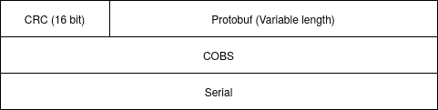
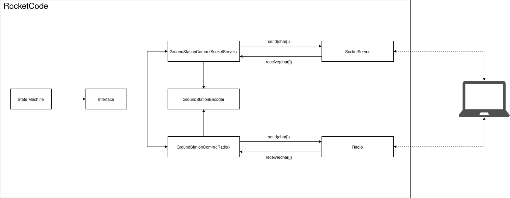

<!-- vim-markdown-toc GFM -->

* [Overview](#overview)
	* [Goals](#goals)
* [Communication](#communication)
	* [Communication Stack](#communication-stack)
	* [Protobuf Messages](#protobuf-messages)
	* [Verified Delivery](#verified-delivery)
* [RocketCode Implementation](#rocketcode-implementation)
* [Ground Station Implementation](#ground-station-implementation)

<!-- vim-markdown-toc -->

# Overview
Currently, the RPi communicates with the Ground Station in two formats. For sending information to the GS (Ground Station), a CSV format is used, sending the raw strings. For receiving information from the GS, a single byte is used per 'message'.

These formats have a few shortcomings. First, sending any information from the GS to the RPi is more or less limited to single events, without any payload (it's possible but error-prone if we use bit-shifting). Also, it can be a bit of a pain to track which byte corresponds to which event. Sending information isn't as bad, but this format makes it impossible to send non-sensor related information (ex: logging messages).

The following document tries to lay down ideas for a new communication system/protocol and propose how it might look like.
## Goals

- Flexible: New messages should be able to be added fairly easily without breaking compatibility.
- Reusable: Make it easy to share the implementation between the TCP and Serial communication methods (and other in the future if needed)
- Safe: Some form of checks should be done to assure the correct message has been received. Furthermore, sending the exact same message twice should be fine.

# Communication

## Communication Stack

The communication stack consists of a few components all working together to reliably send messages between the two devices.

First, at the moment, the physical link will be either serial (with the radio) or TCP. Others could be added in the future.

Second, we need an actual format to send the messages across. For simplicity and flexibility purposes, [Protocol Buffers](https://developers.google.com/protocol-buffers) is used.

Next, we need to have a way to detect errors that would be happening during the transmission. While serial does offer some basic checks with a parity bit, it could be good to have a bit more error checking. Adding a small 16 bit [CRC](https://en.wikipedia.org/wiki/Cyclic_redundancy_check) should be enough for detecting most common errors in the transmission. Note that while the built-in error checking in TCP should be fine for our use, it is ideal to minimize any differences between the serial and TCP implementation, so TCP would still have the CRC.

Finally, because serial and TCP only send streams of bytes, we need to be able to combine those bytes into packets. For this, we use [COBS](https://en.wikipedia.org/wiki/Consistent_Overhead_Byte_Stuffing) to provide packet framing. This allows to use the 0x0 byte to separate each of the packets.

All together, here is how the communication stack would look when using serial. Using TCP would be similar, but with the lower 'Serial" layer replaced with "TCP":

## Protobuf Messages

A global Protobuf message could be used to encapsulate any message needed to be sent in each direction, similar to how it's done currently with the Arduino. So there would be 'GroundStationIn' for messages sent from the RPi to the GS, and 'GroundStationOut' for messages from the GS to the RPi. A `oneof` field inside them would be used to support the various message types we need. Also, some form of unique 'id' field should be present in each message so they can be resent without any danger. See [the next section](#verified-delivery) why this might be useful.

To minimize the work in switching over, at first the sensor data sent from the RPi could still use the CSV format, just wrapped in a Protobuf format. At a later time, when we feel ready, we can replace this CSV format with a Protobuf message containing multiple fields. Note that using Protobuf fields would probably reduce the overall amount of bytes sent compared to CSV.

## Verified Delivery

Why not have a form of automated check that a message arrived successfully? Well, this would probably introduce a lot of unneeded complexity. Instead, an easier option would be simply to send logging messages and monitor them. For critical messages, say changing the state machine state, we could expect a specific message to be shown. If it is never received at the GS, then the message probably never made it, and we should have a way to resend the message. The RPi should be able to detect if it for some reason receives the same message twice and ignore the second one.

# RocketCode Implementation

Currently, the communication is spread across the various `Socket*.cpp` files for TCP, and `Radio.cpp` for Serial/Radio communication.

To try to reuse as much as possible, a new class called `GroundStationComm` could be introduced. Here is an overview how it might fit with the rest of the code:

As the above diagram shows, `GroundStationComm` would use generics, so it can easily have both the `SocketServer` or `Radio` backends. `GroundStationComm` would contain code pertaining to any logic for talking with the Ground Station, and converting between various internal types/structures and Protobuf byte arrays. The only type of data transmitted between the various backends and `GroundStationComm` would be a form of byte arrays. Those backends should never see any internal types (ex: `sensorData`) or Protobuf objects.

Another important piece in the above diagram is the `GroundStationEncoder`. This deals mainly with any conversions between the Protobuf objects and the byte arrays. It's really similar to the existing `ArduinoEncoder`, with the main difference at the moment being the added CRC checks. While it could easily be added to `GroundStationComm`, having it outside could make it easier to add unit tests and to clearly separate the protocol from the rest of the logic.

Last thing to note is that the COBS encoding and decoding would probably have to be done in `SocketServer` and `Radio`. While ideally this part would also be done in `GroundStationEncoder`, the backends need to at least know when to split the incoming packets. With COBS, this is done at the 0x0 byte. Therefore, to keep everything together and consistent, the backends will only communicate with `GroundStationComm` with 'packets' (i.e. fixed length byte arrays). The code to convert to a byte stream (right now using COBS) will be found in the `SocketServer` and `Radio` backends. 

# Ground Station Implementation

The Ground Station implementation can be done similarly. Connection are handled with `TcpConnectionMethod`, `SerialConnectionMethod`, which handle converting the data received into byte array packets. Currently, it splits it by a fixed delimeter set in `AbstractConnectionMethod` that is currently a newline character. This can be changed to `0x0` for cobs. The COBS decoding can be done inside of an abstract method in `AbstractConnectionMethod` to reuse it in both TCP and Serial connections.

The logic for calling the decoder can be handled in `DataProcessor.parseData`. `DataProcessor.parseData` should take in a fixed size byte stream and output a `DataHolder` containing the processed input data.

For processing extra data such as pings, a new `SignalProcessor.parseData` function should be created that can be called by the `DeviceConnection` after calling `DataProcessor.parseData`. This class can save all the information that has different timestamps from the normal telemetry data.